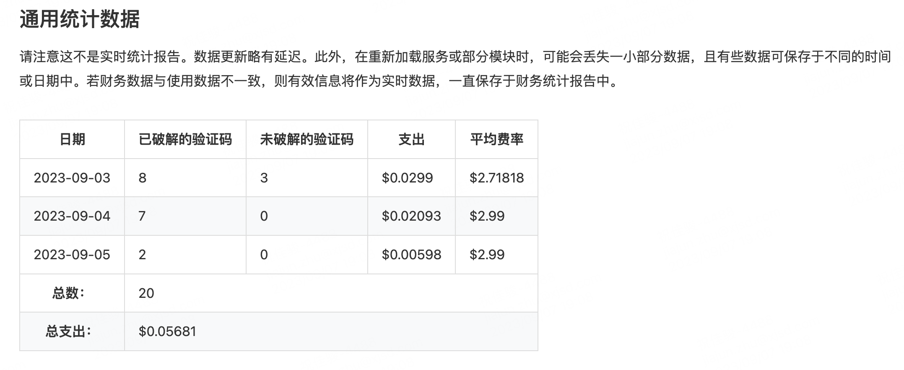
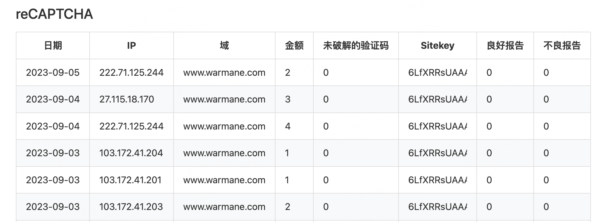
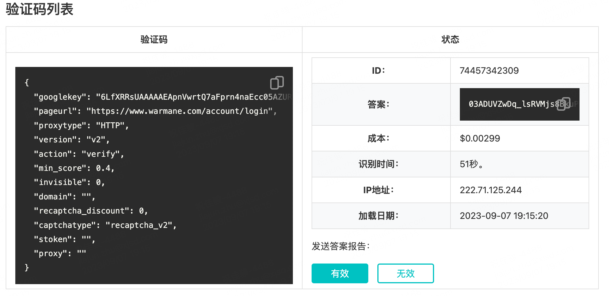
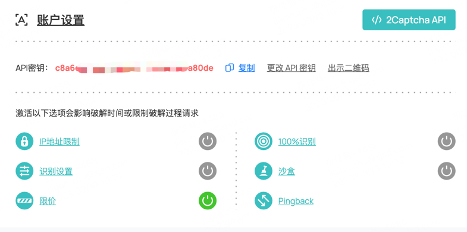
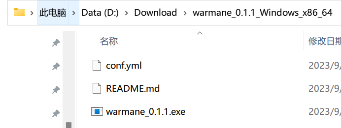
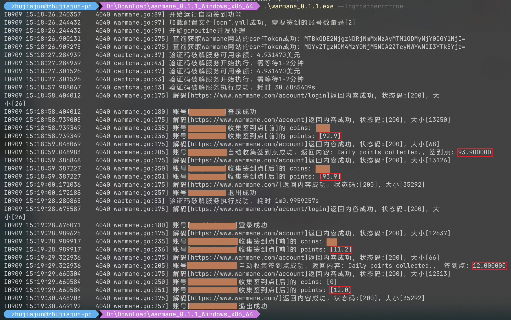

# About warmane

## 这是什么
关于[Warmane](https://www.warmane.com/)网站的一些自动化操作和数据爬取分析功能

## 开发计划
+ [x] 自动登录
+ [x] 验证码识别
+ [x] 自动Points签到
+ [x] 多账户支持
+ [ ] 商城人物数据爬取
+ [ ] 人物数据分析并存储
+ [ ] 多维度查询

## 说明文档
<details><summary>使用的技术</summary><p>

  * go language
  * [colly](https://github.com/gocolly/colly/): 轻量和优雅的爬虫框架
  * [2captcha-go](https://github.com/2captcha/2captcha-go): 验证码识别服务SDK
</p></details>


<details><summary>验证码服务说明</summary><p>

自动登录的验证码识别是由[2captcha](https://cn.2captcha.com/)提供的，是一个收费服务，简单来说就是打码平台，支持验证码类型比国内的同类型平台多很多，单次验证价格比国内的也便宜少许。

验证识别recaptchav2类型(warmane网站使用)的验证码费用是一次`0.00299`美元, 折合人民币`0.022`。

此网站分为员工、客户、开发者三个角色，客户和开发者都是使用验证码服务，将待验证的图片或者数字发到网站队列中，员工角色会收到待验证的图片，进行人工验证，角色可以任意切换，我们也可以切换到员工角色去验证识别各种图形码、数字等，赚的还是美元，不过需要1000次成功验证才能提现。涉及到背后人肉验证，所以整个过程是比较耗时的，完成一个账号自动登录并签到，平均需要1 - 2分钟。

通过支付宝充值了5美元，目前还剩4.95美元, debug程序花费了0.05。

注册网站成功后，切换到开发者角色，会自动产生一个API密钥，复制使用即可，前提是账号里有余额。

当然也可以不注册，使用此程序的API密钥，为了防止滥用，API密钥没有公开到github上，如需要可联系我。





</p></details>


<details><summary>配置文件</summary><p>

配置文件`conf.yml`会和可执行程序打包在一起,默认的配置文件无法运行,需要修改以下两项配置,其他配置不用修改

`captchaApiKey`: 验证码识别服务的API密钥  

`accounts`: 登录warmane网站的账号和密码,可配置多个  

默认配置：
```yaml
captchaApiKey: 2captcha_api_key

accounts:
  - username: your-username
    password: your-password
  - username: your-username
    password: your-password
```
修改成：
```yaml
captchaApiKey: c8a6xxxxxxxxxxxxxxxxxa80de

accounts:
  - username: your-username
    password: your-password
```
captchaApiKey配置项，注册[2captcha](https://cn.2captcha.com/)成功后，切换到开发者，复制API密钥到配置文件中



以上配置只配置了一个账号密码，按yml配置文件规范，注意不要漏掉配置项冒号后面的空格  
如username:` username`
</p></details>


<details><summary>使用说明</summary><p>

* 不支持开通二次验证的账号，Google Auth验证器或邮箱验证
* 下载[https://github.com/zJiaJun/warmane/releases/](https://github.com/zJiaJun/warmane/releases/)最新的release
包，根据自己的操作系统选择，这里以windows_x86_64.zip为例子说明
* 下载并解压，这里的目录是`D:\Download\warmane_0.1.1_Windows_x86_64`
  
* 修改解压出来的conf.yml配置文件
* 打开windows的控制台程序，进入到下载解压的目录 `cd D:\Download\warmane_0.1.1_Windows_x86_64\`
* 运行程序`.\warmane_0.1.1.exe --logtostderr=true`，等待程序运行结束
  
</p></details>
